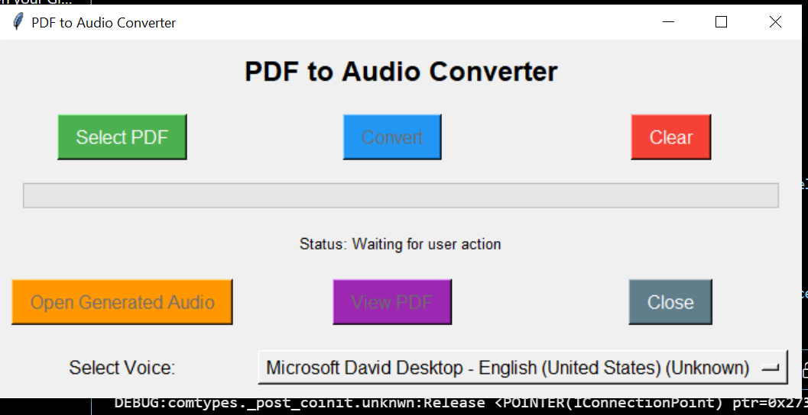

# PDF to Audio Converter

This project converts PDF files to audio using PyPDF4, pyttsx3, and pydub libraries with a GUI built with tkinter.

## Screenshot



## Features

- Convert PDF files to audio
- Select different voices for text-to-speech
- Simple and user-friendly GUI

## Installation

1. Clone the repository:
   ```sh
   git clone https://github.com/Dagim29/pdf-to-audio-converter.git
   ```
2. Navigate to the project directory:
   ```sh
   cd pdf-to-audio-converter
   ```
3. Install the required libraries:
   ```sh
   pip install -r requirements.txt
   ```

## Usage

1. Run the script:
   ```sh
   python pdf_to_audio.py
   ```
2. Use the GUI to select a PDF file and convert it to audio.
